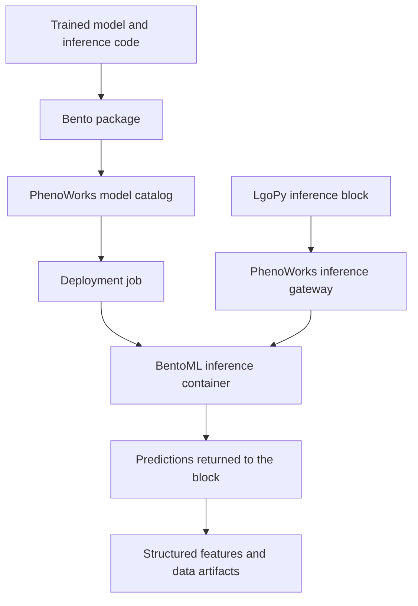

Models are an essential component of modern data science workflows, from
traditional machine learning models built on engineered features to deep
learning models and large language models (LLMs). Yet a model can work well in a
research notebook and still be difficult for a colleague to reuse. The trained
weights are only part of the method. Image normalization, feature order, class
definitions, library versions, and the code that turns predictions into usable
measurements all affect the result.

The current implementation already allows a custom LgoPy block to use a model by
calling its API endpoint. The block author supplies the connection logic and
adapts the model's inputs and outputs to the workflow. We believe PhenoWorks can
build on this capability by providing a standard way to package and reuse models
within LgoPy pipelines, just as data analysis algorithms can already be packaged
as reusable LgoPy blocks.

{/* truncate */}

We are planning an integrated model registry and deployment workflow to support
this approach. Researchers would package an inference service with BentoML,
upload it through the PhenoWorks UI or CLI, deploy it, and use the model through
a LgoPy block. The aim is to preserve the model's requirements and version
alongside its inference method, making it easier to bring trained models into
the same pipelines as other analysis algorithms.

**Status: design in progress.** This post describes the proposed architecture
and implementation milestones. The integrated model upload, deployment, and
inference-block features described here are planned work, with no release date
committed yet.


[](/img/blog/model-packaging-and-inference-roadmap.png)

*Proposed model packaging and inference workflow. The catalog interface and
measurements shown are illustrative. Select the image to view it at full size.*

## Start with externally trained models

Our first goal is to support models trained outside PhenoWorks. Researchers
would continue using their preferred training libraries and compute resources.
Once a model is ready, they would package the inference method and bring it into
the platform.

Consider a canopy-segmentation model trained on one field campaign. For the next
campaign, a colleague should be able to select the same model version, apply the
documented preprocessing, and generate masks and canopy measurements for a new
dataset. The resulting data artifacts should retain enough information to
explain which model, block, and parameters produced them.

This extends the reproducibility story behind
[reusable LgoPy analytical blocks](/blog/building-custom-lgopy-blocks): a method
becomes useful to a team when its behavior and requirements travel with it.

## Meet BentoML: the foundation for our packaging plan

[BentoML](https://github.com/bentoml/BentoML) is an open-source Python framework
for turning model inference code into services that other applications can call.
Developers define how a model loads, what inputs it accepts, and how predictions
are returned. BentoML provides tools to expose that code through an API, package
the service, and build a Docker image for deployment. For readers new to the
project, the [official documentation](https://docs.bentoml.com/en/latest/) is a
good starting point.

We see BentoML as a natural fit for LgoPy's approach to reproducible data science.
LgoPy lets researchers package analysis algorithms as reusable blocks, while
BentoML brings a similar approach to model inference. By connecting the two, we
hope to make trained models easier to share and reuse alongside the processing
steps that turn their predictions into research results.

[BentoML packages inference services as Bentos](https://docs.bentoml.com/en/latest/get-started/packaging-for-deployment.html).
The service definition describes model loading and prediction, while its runtime
configuration records dependencies. A Bento can be turned into a container image
for deployment.

We plan to use this packaging approach as the foundation for model uploads. Our
proposed package contract would describe:

- The inference code, including preprocessing and output conversion.
- The model artifacts it requires, with exact versions or checksums.
- The tested Python and system dependencies.
- The input and output schema, prediction parameters, and task description.

The intended upload is a `.bento` service archive. A weights file alone would
need a compatible service template before it could be deployed. Similarly, an
exported `.bentomodel` artifact does not supply the complete service contract.
The distinction between model storage and service packaging is covered in
[BentoML's model management documentation](https://docs.bentoml.org/en/latest/build-with-bentoml/model-loading-and-management.html).

We plan to provide example BentoML projects that researchers can adapt to their
own trained models. Each example would show how to load the model, prepare its
inputs, expose a prediction method, and declare the dependencies needed to run
it. For example, a scikit-learn project could demonstrate predictions from table
columns, while a YOLO project could demonstrate object detection in images.

We would start by testing one example through the complete workflow: packaging
the model, uploading it to PhenoWorks, deploying it, and using its predictions
in a LgoPy block. Once that works, we would add more examples. Researchers would
still need to adapt preprocessing, labels, and outputs to their own models;
the examples would provide a starting point for that work.

## Keep the registry inside PhenoWorks

We are planning a **Models** area where users could upload packages, inspect
versions, and manage deployments alongside their datasets and analysis blocks.
The UI and CLI would use the same backend operations.

To distinguish a stored model from a running service and its use in a workflow,
we would track three resources:

| Resource | What it records |
| --- | --- |
| Model version | Package, artifact checksums, ownership, task, and input/output contract. |
| Deployment | Exact package version, container image digest, compute allocation, endpoint, and health. |
| Inference block | Workflow inputs, selected deployment, prediction parameters, and output handling. |

Uploading a model would register it without immediately consuming inference
resources. A user could retain several versions and deploy only the ones needed
for current analyses. Stopping a deployment would preserve its registered model
version.

We still need to define the package metadata format and final UI labels. We plan
to settle these through the first working template and deployment, then use that
experience to guide support for additional model families.

## What Deploy would do

We plan to make deployment a background operation. Clicking **Deploy** would
queue a job and let the user follow its progress in PhenoWorks. The deployment
worker would validate the package, resolve its model artifacts, build or reuse a
container image, and reserve the required compute resources before starting
inference. The deployment would become available only after readiness and a
sample prediction check succeed.



We plan to target a single self-hosted Docker machine first. Compose would start
the fixed platform services; the deployment worker would manage model containers
on demand. A gateway would expose stable inference routes, enforce access
permissions, and forward requests to the correct container.

PhenoWorks would manage this lifecycle, including upload permissions,
scheduling, and endpoint access. We would also isolate package builds and
inference execution so that uploaded code cannot inherit the deployment worker's
Docker access or platform credentials.

## Inject a model resolver into LgoPy blocks

PhenoWorks would own model registration, permissions, deployment, and resource
allocation. LgoPy would continue to compose and execute analysis blocks.

We plan to introduce a small `BaseModelRegistry` abstraction in LgoPy and a
PhenoWorks implementation alongside the runtime adapters in
`src/phenoworks/workers/lgopy_runtime_stores.py`. Despite its name, this
interface would resolve models for inference; it would not expose upload,
deployment, or GPU-management operations to blocks.

This follows an existing pattern. `LgoPipeline` assigns metadata and artifact
stores to its blocks, and `BlockSerializer` excludes `artifacts` and `metadata`
from constructor configuration. We would add `models` as another injected
runtime dependency. A block could then request a model by name and version
without embedding a URL in `block.py`. Container names and addresses can change
between deployments; the resolver would own that lookup.

**The following examples illustrate the proposed API; they are not available
in a released LgoPy version.** We would implement and test the interface,
deployment records, and runtime wiring together.

### A small interface in LgoPy

```python
from abc import ABC, abstractmethod
from typing import Any


class BaseModelRegistry(ABC):
    """Resolve inference clients within a pipeline run.

    The runtime owns authorization, version pinning, and client cleanup.
    """

    @abstractmethod
    def get(self, name: str, *, version: str) -> Any:
        """Return a client for a model selected by the runtime.

        Args:
            name: Logical model name within the authorized scope.
            version: Model release constraint, such as '>=0.1.0,<0.2.0'.

        Returns:
            Client exposing the selected service's inference methods.

        Raises:
            LookupError: No authorized, compatible deployment is available.
        """
        ...
```

`Any` here represents service-specific methods such as `greet` or `predict`.
Typed client protocols could describe individual model families later. LgoPy
core would not need to import BentoML to define this interface. An unconfigured
registry would raise a clear error when used, allowing existing blocks that do
not require models to continue working.

The pipeline wiring would extend the current store injection:

```python
# Proposed addition in LgoPipeline, after accepting a models argument.
self.models = models
for _, step in steps:
    if isinstance(step, Block):
        step.artifacts = self.artifacts
        step.metadata = self.metadata
        step.models = self.models
```

`Block` would declare the corresponding `models` attribute. Pipeline factory
methods, deserialization, and any step reconstruction would also need to carry
the dependency. In the serializer's constructor-field loop, the exclusion would
become:

```python
if name in {"artifacts", "metadata", "models"}:
    continue
```

This excludes the registry object, HTTP connections, and credentials from block
configuration. Model names, requested versions, and prediction parameters would
remain serializable configuration. We would also review other serialization and
cloning paths to ensure that live clients and credentials remain confined to the
runtime.

### Resolve deployments on the PhenoWorks side

The proposed resolver would query `model_deployments` and associated model
versions for an authorized `(name, version_spec)` match. We would define a
deterministic selection policy for compatible, ready deployments and pin the
selected model for the run. A constraint like `>=0.1.0` refers to our model
release version, not a lexicographic comparison of BentoML's generated package
tags.

PhenoWorks uses asynchronous database access, while a synchronous LgoPy block
would call `get()` synchronously. Our proposed approach is to resolve declared
model requirements during asynchronous run preparation, persist the exact
choices, and supply a lookup over those pinned records to the block runtime.
This avoids opening an async database session from each synchronous prediction.
Undeclared requirements would fail explicitly; retries would reuse the persisted
choices instead of selecting a newer matching model.

The following adapter sketches how we could create and manage clients. Its
lookup and provenance callbacks represent integration points we would implement;
the lookup would enforce authorization against the run's pinned records.
`BaseModelRegistry` is the interface above.

```python
from contextlib import ExitStack
from dataclasses import dataclass
from typing import Callable

import bentoml


@dataclass(frozen=True)
class ResolvedModel:
    """Pinned model identity and credential-free service address.

    Fields record the logical name, exact release, deployment ID, endpoint,
    Bento archive checksum, and deployed container image digest.
    """

    name: str
    version: str
    deployment_id: str
    endpoint: str
    bento_sha256: str
    image_digest: str


class PhenoWorksModelRegistry(BaseModelRegistry):
    """Provide run-scoped Bento clients for authorized pinned deployments."""

    def __init__(
        self,
        lookup: Callable[[str, str], ResolvedModel],
        record: Callable[[str, str, ResolvedModel], None],
        clients: ExitStack,
        token: str,
    ) -> None:
        """Configure resolution and connection ownership.

        Args:
            lookup: Read an authorized model from the run's pinned records.
            record: Persist the requested name/range and resolved provenance.
            clients: Run-owned context stack that closes clients on exit.
            token: Runtime credential accepted by the inference gateway.
        """
        self._lookup = lookup
        self._record = record
        self._clients = clients
        self._token = token
        self._cache: dict[tuple[str, str], bentoml.SyncHTTPClient] = {}

    def get(self, name: str, *, version: str) -> bentoml.SyncHTTPClient:
        """Return a cached client for a pinned requirement.

        Args:
            name: Authorized logical model name.
            version: Version constraint declared for this run.

        Returns:
            Client exposing the resolved service's methods.

        Raises:
            LookupError: The requirement has no authorized pinned resolution.
        """
        key = (name, version)
        if key not in self._cache:
            resolved = self._lookup(name, version)
            client = self._clients.enter_context(
                bentoml.SyncHTTPClient(
                    resolved.endpoint, token=self._token, timeout=60,
                )
            )
            self._record(name, version, resolved)
            self._cache[key] = client
        return self._cache[key]
```

This adapter would create the client, manage its lifecycle, and return it to the
block. We would place it in the PhenoWorks execution environment, where the
BentoML client dependencies would be installed. Blocks would not need their own
BentoML import, and they would not need the model's training or GPU libraries
merely to call its endpoint.

This cache is a sequential execution sketch. Concurrent block execution would
require synchronized cache initialization and a documented client-sharing
policy, or separate clients per execution worker. Clients would be closed when
the run scope exits, including on failure. File outputs must be copied into the
artifact store before any client-owned temporary files are cleaned up.

### What a block author would write

We would first verify this integration with a Hello World service. A block
author could use the injected registry like this:

```python
from typing import Any

import pandas as pd
from lgopy.core import Block


class ModelGreeting(Block):
    """Demonstrate a model call using the proposed injected registry."""

    def call(self, dataset_item: dict[str, Any]) -> pd.DataFrame:
        """Return a greeting associated with the current plot.

        Args:
            dataset_item: Plot item containing its plot_id.

        Returns:
            One-row table containing the plot identifier and service response.
        """
        model = self.models.get("hello_world", version=">=0.1.0,<0.2.0")
        result = model.greet(name="PhenoWorks")
        return pd.DataFrame([
            {"plot_id": dataset_item["plot_id"], "greeting": result}
        ])
```

The runtime would pre-resolve the block's declared `hello_world` requirement
before execution. We still need to define how blocks declare these requirements
so the runtime can resolve them reliably before a run starts. For a
leaf-segmentation service, the call could instead look like this:

```python
# Fragment inside an image block; local_image_path has already been
# materialized through the platform's storage adapter for this call.
model = self.models.get("leaf_segmentation", version=">=0.1.0,<0.2.0")
result = model.predict(image=local_image_path)
```

The example assumes the service declares a named `image` input. The
[BentoML client](https://docs.bentoml.org/en/latest/build-with-bentoml/clients.html)
maps service methods and handles supported file inputs, including reading a
local `Path` and transmitting its contents. Its schema-aware serialization avoids
handwritten multipart requests. Tensor encoding and image handling still depend
on the service's [declared input/output types](https://docs.bentoml.org/en/latest/build-with-bentoml/iotypes.html).
It does not infer band order, normalization, or geospatial meaning. The gateway
must forward the schema-discovery routes and binary requests as well as the
prediction route, using the same authorization boundary.

### Keep the scanner and provenance contracts explicit

The current builder scans a table of known risky calls. `requests.post` is
flagged, but `self.models.get` is not in that table: no new blanket allowlist is
needed for the current scanner. We plan to add regression checks that preserve
registry usage and the warning for direct network calls. If a future policy uses
an allowlist, it should admit only the documented registry/client operations.
Static call scanning is an audit aid, not enforcement that all network traffic
passes through the registry; runtime network policy would enforce that boundary.

We plan to record the requested version range for each resolved model, together
with its exact `(model_name, version, endpoint)`, deployment ID, Bento archive
checksum, and image digest. The endpoint is a credential-free observation of
where the request went; the digests identify what ran. We would keep that model
pinned across batches and retries. A replacement endpoint may serve the same
pinned artifacts, but a newer model must not be silently substituted.

We would provide task-specific adapters to turn service responses into useful
workflow outputs. Detection results contain boxes, classes, and scores;
segmentation produces masks; a tabular predictor returns values associated with
input rows. Those results must become compatible inputs or artifacts for
subsequent blocks.

For the canopy example, a block could prepare image tiles, call the model, and
assemble masks and measurements while preserving their spatial context. We want
a colleague reviewing those results to be able to trace them to the source
inputs, model artifacts, block version, preprocessing parameters, and runtime
logs. An unavailable deployment would produce an explicit failure.

## Plan for large weights and limited GPUs

Self-contained archives are convenient, but including large weights makes them
large uploads. We plan to accommodate both bundled artifacts and separately
stored weights referenced by checksum. Separate storage would allow service
versions to reuse the same weights, with deployment-time retrieval and caching.
Resumable transfers and artifact retention rules would be needed as model sizes
grow.

For the first GPU deployment, we plan to use one model worker per deployed
package and reserve the GPU exclusively for that deployment. If the GPU is
occupied, another deployment would wait until capacity is released. Multiple
users could still request inference from the running model, subject to
concurrency limits and batching implemented by its service.

We would persist reservations and allocate them atomically so that concurrent
deployment requests and worker restarts cannot double-book the GPU. The
deployment manager would reconcile its records with running containers and
release capacity only after a container stops. This policy controls deployments;
the supported service contract must also constrain how models are loaded inside
each container.

## Deliver the first complete path before expanding

We plan to deliver the first complete workflow through four milestones, each
with a concrete way to verify that it works:

| Milestone | Completion evidence |
| --- | --- |
| Package and register | One documented template can be uploaded through UI and CLI, with version metadata and artifact validation. |
| Deploy and manage | The package runs on one Docker host; readiness, logs, failure reporting, GPU reservation, and Stop controls work. |
| Use in LgoPy | A compatible workflow calls the deployment and persists useful outputs with model provenance. |
| Reproduce and recover | The same version can be redeployed for a repeat run; unavailable endpoints, failed builds, and worker restarts are handled explicitly. |

The first acceptance case would use a real model and dataset, with expected
outputs checked against the original inference implementation. This would test
whether packaging, deployment, and block integration preserve the expected
analysis results.

Once that path is working, we would consider additional templates,
large-artifact transfer, deployment replicas, and a Kubernetes backend. Keeping
the package contract and workflow references independent of the host would make
that transition possible. We would treat cloud autoscaling as a separate stage
of work, with its own scheduling, monitoring, and capacity policies.

## Training inside the platform comes later

We are also considering a future training module that would start from datasets
and annotations prepared in PhenoWorks. It would create a versioned training
snapshot, preserve class mappings and train/validation/test splits, and launch
training on separate CPU or GPU workers.

[MLflow could track those experiments](https://mlflow.org/docs/latest/ml/tracking/),
recording parameters, metrics, checkpoints, and dataset references. We would still need to implement dataset preparation and
training jobs, with the training code running on dedicated workers.

The selected model would then enter the same Bento packaging, registration,
deployment, and LgoPy workflow used by externally trained models. By
establishing that path first, we aim to make trained methods easier to share and
apply to research data, with a record that colleagues can inspect and use to
repeat the analysis in a later campaign.
