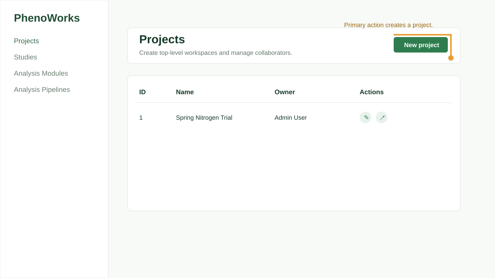

# Projects and Collaboration

Projects are the top-level containers for crop studies. They define ownership and collaboration boundaries.

## When to Use

Create a project when you need a stable workspace for a research program, grant access to collaborators, or group multiple studies under the same objective.

## Step-by-Step Usage

1. Open **Projects**.
2. Select **New project**.
3. Enter a name and description.
4. Select an owner.
5. Save the project.
6. Use the share action to add collaborators when needed.

## Keep supporting documents with the project

Use the editor to attach research files such as PDFs, manuscripts, and protocols
to a project or study. Project membership also controls which datasets and
results a connected [MCP client](phenoworks-mcp.md) or [Agent](phenoworks-agent.md)
can access on a user's behalf.

## Best Practices

- Use clear names that include crop, season, site, or treatment family.
- Keep descriptions short but operationally useful.
- Assign project ownership to the person responsible for data quality.
- Share projects only with users who need access to the study.

## Limitations

- Project deletion should be treated as destructive because lower hierarchy records depend on the project.
- Collaborator access is project-scoped, not per individual dataset.
