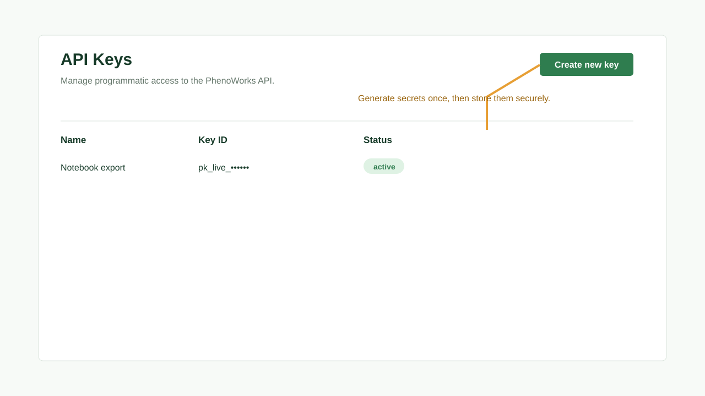

# Users and API Keys

Administrators can manage application users. Signed-in users can create API keys for scripted access.



## User Management

The **Users** page is available to administrators and supports creating users, resetting passwords, and removing users when project ownership constraints allow it.

## API Key Workflow

1. Open **Settings** and then **API Keys**.
2. Select **Create new key**.
3. Enter a descriptive name.
4. Optionally choose an expiration date.
5. Generate the secret.
6. Copy the token immediately.

:::warning

API key secrets are shown once. Store the secret in a secure password manager or deployment secret store.

:::

## Script Usage

Use the generated key as a bearer token when calling the API:

```bash
curl -H "Authorization: Bearer $PHENOWORKS_API_KEY" \
  http://127.0.0.1:9000/api/projects
```

## MCP access

An external MCP client can authenticate with a dedicated key through
`PHENOWORKS_API_KEY`. For a shared HTTP MCP server, per-request forwarding lets
each caller use their own credential. Keys preserve the user's project access;
they do not grant administrator privileges automatically.

Follow [Connect an MCP Client](../tutorials/connect-mcp.md) for configuration.

## Best Practices

- Use separate keys for notebooks, services, and CI jobs.
- Set expirations for temporary integrations.
- Revoke keys that are no longer used.
