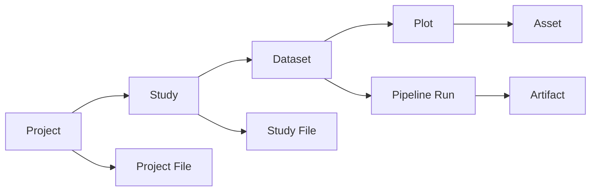

# PhenoWorks

PhenoWorks is a research platform for organizing multimodal sensor data, running reusable analytical workflows, and keeping results connected to the methods that produced them. It brings together data from field experiments, UAV and satellite imagery, environmental readings, field observations, and research documents in one workspace.

Within this workspace, LgoPy analysis blocks transform raw data into structured features and output artifacts for further analysis. These outputs stay connected to their source data and research context, helping teams build a shared scientific knowledge base. Saved workflows, parameters, logs, and results make it possible to review how an analysis was performed and prepare to repeat it on compatible data.

Behind these workflows is LgoPy, an open-source Python library for building data-processing pipelines from reusable analysis blocks. Each block packages a method with defined inputs, outputs, and configurable parameters. Blocks with compatible inputs and outputs can be combined into pipelines, allowing researchers to adapt and reuse methods across datasets.

To work with these data and workflows conversationally, use the [PhenoWorks Agent](tutorials/analyze-with-agent.md). Through questions and requests in plain language, it helps you find data, run available analyses, interpret results, and draft research sections. PhenoWorks MCP extends access to workspace tools to other compatible assistants through authenticated connections. The tasks and file types supported depend on the installed modules and available tools, which can be extended to work with additional modalities, including laboratory measurements and genomic data.

## Follow the workflow

1. [Create a project and study](tutorials/first-project.md) to describe your research and organize its data.
2. [Import and visualize data](tutorials/import-data.md), checking plot labels, sensor modalities, and supporting files.
3. [Run an analysis workflow](tutorials/run-workflow.md) to process data and extract structured features.
4. [Review and export results](tutorials/view-export-results.md) for comparison, reporting, or further analysis.
5. [Work with the Agent](tutorials/analyze-with-agent.md) to explore findings and draft research sections.

To extend the available analysis methods, follow [Build Custom LgoPy Blocks](tutorials/build-custom-lgopy-blocks.md).

## Study Hierarchy

PhenoWorks organizes research from its broad purpose down to individual observations: **Project → Study → Dataset → Plot → Asset**. Supporting files attach to the project or study they describe. Analysis runs belong to datasets, and the outputs they generate are stored as artifacts.

The diagram shows these relationships, rather than a required sequence of upload steps. A project can contain several studies, a study several datasets, and a plot several assets.

### Project: the overall research effort

A **Project** is the top-level workspace for a research effort, such as a breeding programme, a grant-funded investigation, or a series of related trials. It groups studies and shared files under one name and description. Project ownership and collaborator membership determine who can access the work.

For example, a project named **Wheat Drought Response** could contain studies from several seasons or locations. Use the project description to explain the broader research question; use studies to describe the individual experiments.

### Study: the experimental context

A **Study** belongs to a project and describes a particular experiment, season, site, or campaign. It can record a description, abstract, methods summary, start and end dates, and additional metadata. Its datasets contain the observations, while its study files hold supporting documents.

Within **Wheat Drought Response**, a study named **2026 Irrigation Trial** might describe the treatment design, growing season, and measurement protocol. Several collection dates can belong to this same study; a new batch of data does not necessarily require a new study.

### Dataset: a collection of data to analyze together

A **Dataset** belongs to a study and groups the plots and assets you intend to process together. It records a name, description, location, coordinates, and supported sensor modalities. Datasets can also hold contextual information such as weather observations and visualization settings. Analysis pipelines run against a selected dataset.

For example, **Field Visit — 15 June 2026** could contain RGB, thermal, and multispectral observations for the plots in the irrigation trial. A later visit could become another dataset within the same study. Choose dataset boundaries that make sense for your collection process and analysis methods.

### Plot: the unit observed within a dataset

A **Plot** represents an experimental unit within a dataset. It has a name, an optional plot code, notes, and an optional geographic boundary. Its assets hold the observations associated with that unit.

For example, **Plot A12** could contain several sensor files collected during the June visit. Plot records belong to individual datasets, so use consistent plot codes across collection dates to make later comparisons easier. Matching codes provide a useful convention; they do not make the records a single shared plot.

### Asset: an observation associated with a plot

An **Asset** is a registered data file attached to a plot, such as an RGB image, thermal image, or multispectral raster. Its record describes the modality and data type and can include acquisition time, sensor name, position, band information, and other metadata.

For example, a multispectral raster for **Plot A12** is an asset within the June dataset. Its band information helps you select compatible analysis methods and configure their inputs. The modalities and formats a workflow can process depend on its analysis blocks.

### Project File: shared source material or reference data

A **Project File** belongs directly to the project. Use it for source material or references that support the broader research effort, such as an orthomosaic, a plot-boundary file, an archive of sensor data, or a document relevant to several studies. Its record includes a name, purpose, format, description, and processing status; spatial files can also carry coordinate-system and extent information.

For example, upload a packaged collection under the project's **Files**, then use **Unzip to Dataset** to import it into a selected study. The archive is a project file; the imported observations become assets organized within the dataset. Uploading a project file alone does not make it a plot asset ready for every analysis workflow.

### Study File: documents that explain an experiment

A **Study File** belongs to one study and holds its written or supporting context. Examples include the experiment's protocol, treatment description, field notes, reference papers, or manuscript draft. Its record includes a name, purpose, format, description, and processing status.

For the **2026 Irrigation Trial**, keep the season-specific protocol with the study. A reference used across several studies may fit better as a project file. These documents help explain the observations; they are distinct from the plot assets an analysis block expects as inputs.

### Pipeline Run: a recorded analysis of a dataset

A **Pipeline Run** records an analysis submitted for a selected dataset. It identifies the workflow and parameters, tracks execution status and timing, and connects the analysis to its generated artifacts. The workspace also provides execution logs for checking progress and diagnosing failures.

For example, run a compatible vegetation-index workflow on the June dataset, then review its definition, band parameters, logs, and outputs before applying the method to another collection date. A reusable workflow describes the method; a run records a particular execution of it.

### Artifact: an output produced by an analysis

An **Artifact** is a saved output generated by a pipeline run, such as a feature table, processed image, segmentation mask, figure, or statistical summary. It is linked to the run and dataset and may also refer to a particular plot. The outputs available depend on the blocks used in the workflow.

For example, a table summarizing vegetation-index values by plot is an artifact of the June analysis. Keep it with the run for review, or download it for downstream analysis in a notebook or statistical package.

Together, these levels connect the research question, experimental context, observations, methods, and outputs. Start with [Creating Your First Project](tutorials/first-project.md), then follow [Importing Data](tutorials/import-data.md) to put that structure into practice.

## Software Architecture

PhenoWorks combines a browser workspace, an API, background workers, and persistent storage. These components let researchers organize data, submit analyses, and review results without keeping a browser request open for the duration of a processing job.

- **Web workspace and API.** The Next.js frontend provides the user interface. The FastAPI backend manages authentication, access checks, research metadata, files, and analysis operations. Resumable uploads support large data transfers.
- **Background processing.** In the Celery deployment, RabbitMQ queues work for one or more workers. Workers process files and execute pipelines, with progress, logs, and outputs available in the workspace. Local development can also use the embedded operation queue.
- **Persistent storage.** PostgreSQL with PostGIS stores research and spatial metadata. File storage holds uploaded data, analysis packages, logs, and generated artifacts.
- **Deployment.** Docker Compose brings the services together for self-hosting. Additional workers can increase processing capacity, while pgAdmin provides a database administration interface.

### Docker Compose Service Architecture

## Main Modules

| Module | Responsibility |
| --- | --- |
| API routers | Expose endpoints for authentication, research data, uploads, operations, pipelines, analysis modules, and user access. |
| Services | Apply business rules and access checks, coordinate file ingestion, and manage analysis operations. |
| Stores | Read and write metadata, source files, analysis packages, and generated artifacts through dedicated storage interfaces. |
| Workers | Execute queued operations and report progress, logs, failures, and completion. |
| Analysis catalog | Manage installed LgoPy modules, search available methods, and expose their source code and requirements. |
| Operation execution | Track durable processing requests and dispatch them through the configured local or Celery queue. |
| Frontend | Provide the authenticated research workspace using Next.js and Material UI. |
| PhenoWorks Agent | Help researchers process data, interpret results, and prepare drafts using connected tools and available evidence. |
| PhenoWorks MCP | Expose authenticated workspace tools to compatible AI assistants. |

## Extensibility Model

[LgoPy](https://github.com/OpenSciML/lgopy) provides the reusable analysis blocks that extend PhenoWorks for different crops, sensors, and research methods. Each block performs a focused task with defined inputs and outputs, such as calculating a vegetation index, adjusting image contrast, or extracting canopy cover.

Developers package methods as versioned LgoPy modules. Researchers install them in the analysis catalog, inspect their source and requirements, and connect compatible blocks into dataset-level pipelines. A block's output must match the next block's expected input; a saved artifact is not necessarily the value passed to the next step.

This approach lets teams add or refine analytical methods without rebuilding the core platform. Start with methods that support your data, check their parameters and dependencies, and reuse the workflow across compatible datasets. Generated artifacts remain associated with the analysis and its research context.

## User Interaction Model

Most researchers work in the browser: sign in, select a project and study, then open the editor to organize datasets, plots, and files. From the analysis catalog and pipeline views, inspect available methods, configure an analysis, follow its progress, and preview or download the results.

The Agent offers a conversational route to supported tasks in the same workspace. Its actions depend on the connected tools and your access permissions. Review generated interpretations and research drafts against the underlying data and methods before using them in a publication or proposal.

## License and citation

PhenoWorks is licensed under the [Apache License 2.0](https://github.com/OpenSciML/phenoworks/blob/main/LICENSE). Third-party dependencies retain their own licensing terms.

If you use PhenoWorks in research, please cite the software using [CITATION.cff](https://github.com/OpenSciML/phenoworks/blob/main/CITATION.cff). The repository's **Cite this repository** menu provides APA and BibTeX formats. Citation is appreciated and is not an additional license condition.
