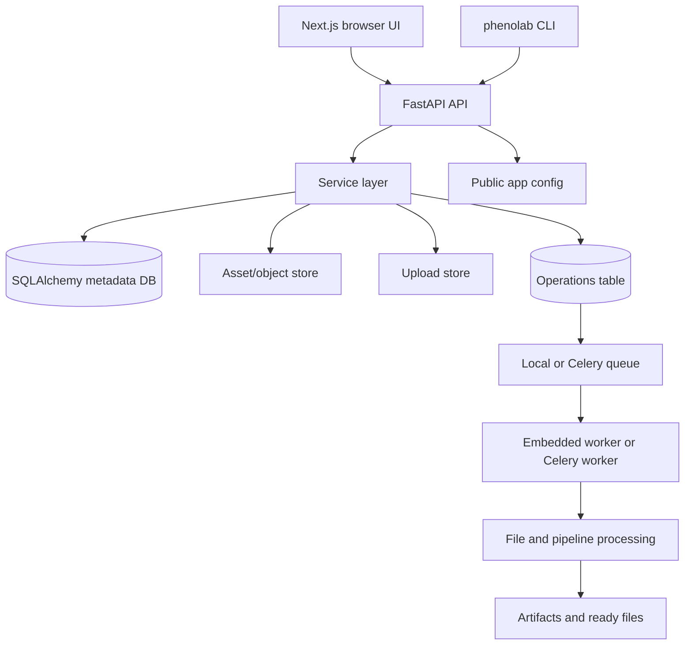
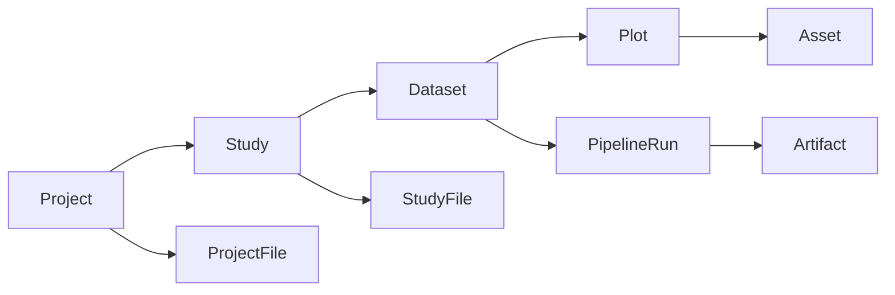

# PhenoLab

PhenoLab helps research teams move from multimodal field observations to defensible findings and reusable research outputs. It brings field trials, UAV and satellite imagery, sensor measurements, laboratory and genomic data, metadata, and treatments into a shared workflow for quality control, statistical modeling, visualization, and reproducible analysis.

The resulting datasets, features, figures, tables, models, statistics, methods, provenance, and literature form a scientific knowledge base. The PhenoLab Agent is designed to use that context to help users process, analyze, and interpret their data, supporting downstream analysis, scientific discovery, manuscripts, and grant proposals.

## Software Architecture

The current software combines a browser-based Next.js frontend, a FastAPI backend API, a relational metadata database, replaceable file/object storage boundaries, an analysis module catalog, resumable uploads, and durable background operations. The backend runs locally in the current development workflow, with a clear path to cloud-hosted API, database, object storage, and workers.

The platform is intentionally crop-agnostic. A deployment can reuse the same application and change only `phenolab.config.json` or `PHENOLAB_APP_CONFIG_FILE` to customize the visible product title, subtitle, logo, and Material UI color theme. Crop-specific analytical behavior belongs in reusable, versioned LgoPy modules rather than deployment-specific application variants.

### Current Service Architecture

## Main Modules

| Module | Responsibility |
| --- | --- |
| API routers | HTTP endpoints for auth, projects, studies, editor tree data, uploads, assets, operations, pipelines, analysis modules, users, and API keys. |
| Services | Business rules, access checks, operation lifecycle, file ingestion, asset handling, and analysis block operations. |
| Stores | Metadata, asset, artifact, and filesystem persistence boundaries that can be replaced for cloud deployments. |
| Workers | Background queue recovery, claiming, progress updates, logs, cancellation, and retries. |
| Analysis catalog | LgoPy package storage, deterministic search, optional semantic search, source inspection, requirements review, and install/delete workflows. |
| Operation execution | Dataset and file-processing work submitted as durable operations, then executed by the embedded local queue or the Celery/RabbitMQ worker stack. |
| Frontend | Authenticated operational UI built with Next.js App Router and Material UI. |

## Extensibility Model

LgoPy analysis modules provide the modular method layer for phenotyping and remote-sensing workflows. A useful way to understand them is to imagine every data-processing step, measurement, or algorithm as a Lego block. One block might calculate NDVI, another might run image quality control, another might extract canopy cover, and another might estimate a crop-specific trait. Each block does one focused job, has a clear input and output, and can be reused across datasets.

PhenoLab uses this block model so research software developers can package analytical methods as versioned LgoPy modules instead of hard-coding them into the application. Research scientists and analysts can then install those modules into the PhenoLab catalog, search them from the UI or CLI, inspect their source and requirements, and combine compatible blocks into dataset-level pipelines. In practice, a workflow becomes a sequence of reusable pieces: choose the blocks that match the dataset, connect them in the right order, run the pipeline, and keep the resulting artifacts, figures, tables, and metadata tied back to the original study.

This design keeps the core PhenoLab application crop-agnostic while still allowing specialized methods to be added for particular crops, sensors, traits, experiments, or institutions. Teams can start with common blocks for standard phenotyping tasks and add new blocks as their methods mature, without rebuilding the whole platform.

## User Interaction Model

Most users work in the browser:

1. Sign in.
2. Create or select a project.
3. Create studies for seasons, sites, campaigns, or supporting documents.
4. Open the editor to create datasets, plots, files, and assets.
5. Install or inspect analysis modules.
6. Run dataset-level pipelines.
7. Monitor logs and progress.
8. Preview or download outputs.

Developers and automation scripts can also use the CLI or API keys for programmatic access.

## Study Hierarchy

## Platform Model

The browser UI communicates with the backend API. The backend owns metadata, authentication, operations, assets, artifacts, uploads, and module catalog state. In local development, files and artifacts live under the configured data directory. In a hosted deployment, those same boundaries can map to managed databases, object storage, and worker infrastructure.

:::note

This keeps local development simple while preserving the web-platform shape needed for a future cloud backend.

:::
