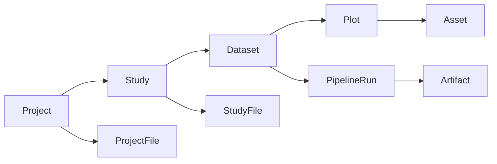

# PhenoWorks

PhenoWorks brings field trials, imagery, sensor readings, metadata, treatments, and research documents into one workspace. Load and visualize your data, then use LgoPy blocks to turn raw observations into structured features for analysis. The platform can be extended to other modalities, including laboratory measurements and genomic data.

Keep the resulting features, figures, tables, and methods connected to their source data in a [Scientific Knowledge Base](features/scientific-knowledge-base.md). Work with the [PhenoWorks Agent](features/phenoworks-agent.md) to analyze results, interpret evidence, and draft research sections. [PhenoWorks MCP](features/phenoworks-mcp.md) connects compatible assistants to the workspace through authenticated tools.

## Follow the workflow

1. [Create a project and study](tutorials/first-project.md).
2. [Import and visualize data](tutorials/import-data.md).
3. [Run a processing or feature-extraction workflow](tutorials/run-workflow.md).
4. [Review and export results](tutorials/view-export-results.md).
5. [Analyze with the Agent](tutorials/analyze-with-agent.md) and [draft research sections](tutorials/draft-research-sections.md).

To use another compatible assistant, [connect an MCP client](tutorials/connect-mcp.md).

## Software Architecture

PhenoWorks combines a web workspace, a backend API, background processing workers, and persistent storage to support research data management and analysis. These components work together to organize datasets, run reusable workflows, and keep results connected to their source data.

The Next.js frontend provides the research workspace, while the FastAPI backend manages data access, metadata, and analysis operations. Developer tools can also use the API directly, and resumable uploads support transferring large datasets.

RabbitMQ queues processing tasks for one or more Celery workers. Multiple workers can process files and run analysis pipelines in parallel, allowing capacity to grow with demand. Jobs run independently of browser requests, with progress, logs, and outputs available in the workspace.

PostGIS stores research and spatial metadata, while shared storage holds uploaded files and generated artifacts. Docker Compose brings these services together for self-hosted deployment, with pgAdmin available for database administration.

### Docker Compose Service Architecture

## Main Modules

| Module | Responsibility |
| --- | --- |
| API routers | HTTP endpoints for auth, projects, studies, editor tree data, uploads, assets, operations, pipelines, analysis modules, users, and API keys. |
| Services | Business rules, access checks, operation lifecycle, file ingestion, asset handling, and analysis block operations. |
| Stores | Metadata, asset, artifact, and filesystem persistence boundaries that can be replaced for cloud deployments. |
| Workers | Background queue recovery, claiming, progress updates, logs, cancellation, and retries. |
| Analysis catalog | LgoPy package storage, deterministic search, optional semantic search, source inspection, requirements review, and install/delete workflows. |
| Operation execution | Dataset and file-processing work submitted as durable operations, then executed by the embedded local queue or the Celery/RabbitMQ worker stack. |
| Frontend | Authenticated operational UI built with Next.js App Router and Material UI. |
| PhenoWorks Agent | Conversational assistance for processing, analysis, interpretation, and research drafts using available tools. |
| PhenoWorks MCP | Authenticated tool access to datasets, analysis blocks, pipelines, and artifacts for compatible assistants. |

## Extensibility Model

[LgoPy](https://github.com/OpenSciML/lgopy) is an open-source Python library for building modular data-processing and analysis pipelines. It provides the reusable analysis blocks that extend PhenoWorks for different crops, sensors, and research methods.

Like Lego pieces, each block performs one focused task with defined inputs and outputs. A block might calculate NDVI, check image quality, extract canopy cover, or estimate a crop-specific trait. Compatible blocks connect into pipelines that researchers can share and reuse across datasets.

PhenoWorks uses this block model so research software developers can package analytical methods as versioned LgoPy modules instead of hard-coding them into the application. Research scientists and analysts can then install those modules into the PhenoWorks catalog, search them from the UI or CLI, inspect their source and requirements, and combine compatible blocks into dataset-level pipelines. In practice, a workflow becomes a sequence of reusable pieces: choose the blocks that match the dataset, connect them in the right order, run the pipeline, and keep the resulting artifacts, figures, tables, and metadata tied back to the original study.

This design keeps the core PhenoWorks application crop-agnostic while still allowing specialized methods to be added for particular crops, sensors, traits, experiments, or institutions. Teams can start with common blocks for standard phenotyping tasks and add new blocks as their methods mature, without rebuilding the whole platform.

## User Interaction Model

Most users work in the browser:

1. Sign in.
2. Create or select a project.
3. Create studies for seasons, sites, campaigns, or supporting documents.
4. Open the editor to create datasets, plots, files, and assets.
5. Install or inspect analysis modules.
6. Run dataset-level pipelines.
7. Monitor logs and progress.
8. Preview or download outputs.

Developers and automation scripts can also use the CLI or API keys for programmatic access.

## Study Hierarchy

## Platform Model

The browser UI communicates with the backend API. The backend owns metadata, authentication, operations, assets, artifacts, uploads, and module catalog state. In local development, files and artifacts live under the configured data directory. In a hosted deployment, those same boundaries can map to managed databases, object storage, and worker infrastructure.

:::note

This keeps local development simple while preserving the web-platform shape needed for a future cloud backend.

:::
