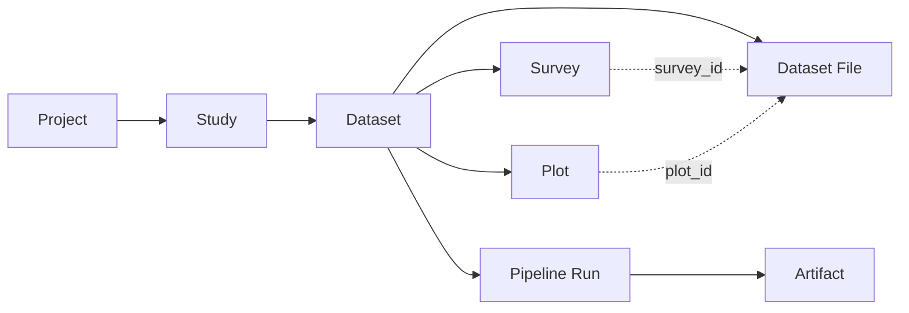

# PhenoWorks

PhenoWorks is a research platform for organizing multimodal sensor data, running reusable analytical workflows, and keeping results connected to the methods that produced them. It brings together data from field experiments, UAV and satellite imagery, environmental readings, field observations, and research documents in one workspace.

Within this workspace, LgoPy analysis blocks transform raw data into structured features and output artifacts for further analysis. These outputs stay connected to their source data and research context, helping teams build a shared scientific knowledge base. Saved workflows, parameters, logs, and results make it possible to review how an analysis was performed and prepare to repeat it on compatible data.

Behind these workflows is LgoPy, an open-source Python library for building data-processing pipelines from reusable analysis blocks. Each block packages a method with defined inputs, outputs, and configurable parameters. Blocks with compatible inputs and outputs can be combined into pipelines, allowing researchers to adapt and reuse methods across datasets.

To work with these data and workflows conversationally, use the [PhenoWorks Agent](tutorials/analyze-with-agent.md). Through questions and requests in plain language, it helps you find data, run available analyses, interpret results, and draft research sections. PhenoWorks MCP extends access to workspace tools to other compatible assistants through authenticated connections. The tasks and file types supported depend on the installed modules and available tools, which can be extended to work with additional modalities, including laboratory measurements and genomic data.

## Follow the workflow

1. [Create a project and study](tutorials/first-project.md) to describe your research and organize its data.
2. [Import and visualize data](tutorials/import-data.md) as single files, plot-organized ZIP archives, or field-wide maps split by plot boundaries.
3. [Install analysis modules](tutorials/manage-modules.md) that read your sensors and data products.
4. [Run an analysis workflow](tutorials/run-workflow.md) to process data and extract structured features.
5. [Review and export results](tutorials/view-export-results.md) for comparison, reporting, or further analysis.
6. [Work with the Agent](tutorials/analyze-with-agent.md) to explore findings and draft research sections.

The **Set up an analysis** guide on **Home** combines steps 1 to 4: choose your
platform and sensors, create the project, upload the data, and pick compatible
analyses in one flow.

To extend the available analysis methods, follow [Build Custom LgoPy Blocks](tutorials/build-custom-lgopy-blocks.md).

## Data Model

PhenoWorks organizes research from its broad purpose down to individual files:
**Project → Study → Dataset → Dataset file**. Every file belongs to one dataset.
Surveys and plots describe when and where a dataset's files were collected.
Analyses run on datasets as pipeline runs, and the outputs they generate are
stored as artifacts.

The diagram shows these relationships rather than a required sequence of upload
steps. A project can contain several studies, a study several datasets, and a
dataset many files.

```mermaid
flowchart LR
  Project --> Study
  Study --> Dataset
  Dataset --> File[Dataset File]
  Dataset --> Survey
  Dataset --> Plot
  Survey -. survey_id .-> File
  Plot -. plot_id .-> File
  Dataset --> PipelineRun[Pipeline Run]
  PipelineRun --> Artifact
```

The dotted lines are metadata labels on each file, not ownership: deleting a
plot or survey keeps its labelled files.

### Project: the overall research effort

A **Project** is the top-level workspace for a research effort, such as a breeding programme, a grant-funded investigation, or a series of related trials. It groups studies under one name and description. Project ownership and collaborator membership determine who can access the work: members can view the data and results, and the owner can upload and change it.

For example, a project named **Wheat Drought Response** could contain studies from several seasons or locations. Use the project description to explain the broader research question; use studies to describe the individual experiments.

### Study: the experimental context

A **Study** belongs to a project and describes a particular experiment, season, site, or campaign. It can record a description, abstract, methods summary, start and end dates, and additional metadata. Its datasets contain the data.

Within **Wheat Drought Response**, a study named **2026 Irrigation Trial** might describe the treatment design, growing season, and measurement protocol. Several collection dates can belong to this same study; a new batch of data does not necessarily require a new study.

### Dataset: data to analyze together

A **Dataset** belongs to a study and holds the files you intend to process together. It records a name, description, and optional location; when a location is given, PhenoWorks fetches the weather for the collection date in the background. Analysis pipelines run against a selected dataset.

For example, **Irrigation Trial Field** could hold the drone orthomosaics, plot boundaries, and ground-robot captures for the trial's plots across the season. Choose dataset boundaries that make sense for your collection process and analysis methods.

### Dataset file: one stored file and its classification

A **Dataset file** is any file in a dataset: an RGB image, a multispectral orthomosaic, a LiDAR point cloud, a CSV of measurements, a plot-boundary GeoPackage, or a protocol PDF. Files keep the folders they were imported with. Each file is classified on two axes:

- **Data product**: what the file is, such as `image`, `orthomosaic`, `point_cloud`, `csv`, or `document`. It decides the accepted extensions, the viewer, and which analysis modules apply.
- **Modality**: which sensor captured it, such as `rgb`, `thermal`, `multispectral`, `hyperspectral`, `lidar`, or `gpr`, or `none` for files without a sensor.

An optional **processing method** (`photogrammetry`, `registration`, `slam`, `direct`) records how a derived product was made. A point cloud is a `point_cloud` whether it comes from a LiDAR scan or from drone photos processed by photogrammetry. Files also carry metadata such as named bands, sensor, capture time, and any fields supplied at upload, like `treatment`. Administrators manage the modality and data-product catalogs under **Data types**.

### Survey: one data collection

A **Survey** is a dated data collection within a dataset, such as the drone flight on 10 June. Files join a survey through the `survey_id` in their metadata; a plot boundaries import assigns one automatically from the capture date. Keeping several surveys in one dataset lets you compare the same plots over the season.

### Plot: the experimental unit

A **Plot** is an experimental unit, such as **Plot A12**. Files belong to a plot through the `plot_id` in their metadata, supplied in a ZIP sidecar or set by a plot boundaries import, which also creates the plot records from the polygons. When a pipeline runs, files sharing a `plot_id` are delivered together, so a module can read a plot's RGB, NIR, and thermal files at once. Files without a plot label are analyzed one at a time. Use consistent plot IDs across surveys to make later comparisons easier.

### Pipeline Run: a recorded analysis of a dataset

A **Pipeline Run** records an analysis submitted for a selected dataset. It identifies the modules and parameters, tracks execution status and timing on **Jobs**, and connects the analysis to its generated artifacts. Its processing log helps you check progress and diagnose failures. A run has one ID across the web workspace, the SDKs, and the Agent.

For example, run a vegetation-index module on the June survey, then review its definition, band parameters, logs, and outputs before applying the method to another survey. A reusable workflow describes the method; a run records a particular execution of it.

### Artifact: an output produced by an analysis

An **Artifact** is a saved output generated by a pipeline run, such as a feature table, processed image, segmentation mask, figure, or statistical summary. It is linked to the run and dataset, may refer to a particular plot, and can carry metadata such as the survey it describes. The outputs available depend on the modules used in the workflow.

For example, a table summarizing vegetation-index values by plot is an artifact of the June analysis. Keep it with the run for review, or download it for downstream analysis in a notebook or statistical package.

Together, these levels connect the research question, experimental context, observations, methods, and outputs. Start with [Creating Your First Project](tutorials/first-project.md), then follow [Importing Data](tutorials/import-data.md) to put that structure into practice.

## Software Architecture

PhenoWorks combines a browser workspace, an API, background workers, and persistent storage. These components let researchers organize data, submit analyses, and review results without keeping a browser request open for the duration of a processing job.

- **Web workspace and API.** The Next.js frontend provides the user interface. The FastAPI backend manages authentication, access checks, research metadata, files, and analysis operations. Resumable uploads support large data transfers.
- **Background processing.** In the Celery deployment, RabbitMQ queues work for one or more workers. Workers process files and execute pipelines, with progress, logs, and outputs available in the workspace. Local development can also use the embedded operation queue.
- **Persistent storage.** PostgreSQL with PostGIS stores research and spatial metadata. File storage holds uploaded data, analysis packages, logs, and generated artifacts. TiTiler serves orthomosaics to the map viewer.
- **Optional services.** NodeODM turns drone flight images into orthomosaics, elevation models, and point clouds. Docling Serve converts documents into structured text for the planned knowledge index. Both run independently, on CPU or NVIDIA GPU.
- **Deployment.** Docker Compose brings the services together for self-hosting. Additional workers can increase processing capacity, while pgAdmin provides a database administration interface.

### Docker Compose Service Architecture

## Main Modules

| Module | Responsibility |
| --- | --- |
| API routers | Expose endpoints for authentication, research data, dataset files, surveys, uploads, operations, pipeline runs, analysis modules, data types, and user access. |
| Services | Apply business rules and access checks, coordinate file ingestion and plot extraction, and manage analysis operations. |
| Stores | Read and write metadata, dataset files, analysis packages, and generated artifacts through dedicated storage interfaces. |
| Data types catalog | Define the modalities and data products files can use, with each product's accepted extensions. |
| Workers | Execute queued operations and report progress, logs, failures, and completion. |
| Analysis catalog | Manage installed LgoPy modules, search available methods, and expose their source code and requirements. |
| Operation execution | Track durable processing requests and dispatch them through the configured local or Celery queue. |
| Frontend | Provide the authenticated research workspace using Next.js and Material UI. |
| PhenoWorks Agent | Help researchers process data, interpret results, and prepare drafts using connected tools and available evidence. |
| PhenoWorks MCP | Expose authenticated workspace tools to compatible AI assistants. |
| Python SDK and CLI, R client | Script uploads, pipeline runs, and downloads from notebooks and the terminal. |

## Extensibility Model

[LgoPy](https://github.com/OpenSciML/lgopy) provides the reusable analysis blocks that extend PhenoWorks for different crops, sensors, and research methods. Each block performs a focused task with defined inputs and outputs, such as calculating a vegetation index, adjusting image contrast, or extracting canopy cover.

Developers package methods as versioned LgoPy modules. Each module declares the sensor and data-product pairs it reads, such as `multispectral:orthomosaic`, so PhenoWorks and the Agent can offer only the modules that fit a dataset. Researchers install them from **Modules**, inspect their source and requirements, and connect compatible blocks into dataset-level pipelines. A block's output must match the next block's expected input; a saved artifact is not necessarily the value passed to the next step.

This approach lets teams add or refine analytical methods without rebuilding the core platform. Start with methods that support your data, check their parameters and dependencies, and reuse the workflow across compatible datasets. Generated artifacts remain associated with the analysis and its research context.

## User Interaction Model

Most researchers work in the browser: sign in, follow the guided setup on **Home** or open the **Editor** to create datasets, upload files, and explore them on the map. From **Modules** and **Jobs**, inspect available methods, configure an analysis, follow its progress, and preview or download the results. The Python and R clients offer the same tasks from code.

The Agent offers a conversational route to supported tasks in the same workspace. Its actions depend on the connected tools and your access permissions. Review generated interpretations and research drafts against the underlying data and methods before using them in a publication or proposal.

## License and citation

PhenoWorks is licensed under the [Apache License 2.0](https://github.com/OpenSciML/phenoworks/blob/main/LICENSE). Third-party dependencies retain their own licensing terms.

If you use PhenoWorks in research, please cite the software using [CITATION.cff](https://github.com/OpenSciML/phenoworks/blob/main/CITATION.cff). The repository's **Cite this repository** menu provides APA and BibTeX formats. Citation is appreciated and is not an additional license condition.
