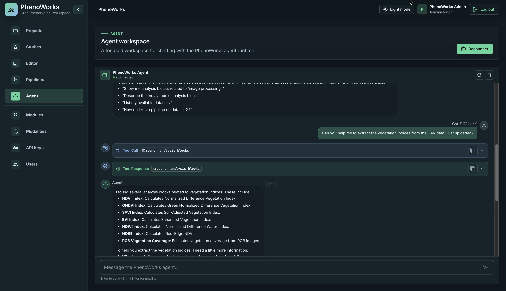

# Tutorial: Analyze Data with the Agent

In this tutorial, you will learn how to interact with the PhenoWorks Agent using
natural-language messages. You can describe your research question, ask about a
dataset, or request a processing task in the chat. The agent can help you find
available analysis modules, check their input requirements, run analysis
pipelines, follow their progress, and review the results.

The steps below take you from identifying a dataset to interpreting its outputs.
The tasks available to the agent depend on your installed modules and account
permissions.

## 1. Identify the data

Open **Agent** and start by giving the dataset name or ID:

> I want to analyze dataset 7. What images and modalities does it contain?

Check that the agent has identified the dataset you intend to use. Describe the
crop, imaging setup, and research question to help it find a suitable method.

## 2. Ask for a processing task

For multispectral imagery:

> Can you calculate NDVI for this dataset? Check the available bands and explain which inputs the method needs.

Confirm the NIR and red band indices before running the block. For RGB imagery,
try a suitable image-processing request instead:

> Can you apply histogram equalization to the RGB images in my dataset?

Or ask about a correction without assuming a specific block is appropriate:

> I would like to improve the lighting in these images. Can you find a correction method that fits my imaging setup?

The agent can search installed analysis modules, also called blocks, and inspect
their input requirements. Access to source code and detailed metadata may require
administrator permissions.

## 3. Review and run

Before starting the analysis, ask the agent to validate the proposed pipeline:

> Check that the processing steps, inputs, and parameters are valid. Summarize the pipeline before running it.

Review the dataset, method version, and parameters, then ask the agent to run the
pipeline. Depending on the client you use, you may see a separate confirmation
form before submission.

Keep the returned pipeline ID. It identifies the analysis job; the operation ID
refers to the background task and is not interchangeable with it.

## 4. Follow progress and inspect outputs

> Check this pipeline's progress and retrieve its output table when it is complete.

If the run fails, ask the agent to explain the error and review the logs before
trying again. Once the pipeline completes successfully, open its output files in
**Analysis Pipelines** and compare a few results with the source data. Submitting
a pipeline starts the job; check its status to confirm that processing has finished.

## 5. Interpret the result

> Can you help me interpret the differences in NDVI across these plots? Identify any missing treatment or acquisition information.

Review the agent's interpretation against the measurements and study design.
When you have results ready to describe, ask the agent to help draft a research
section using the methods and findings from your analysis.
