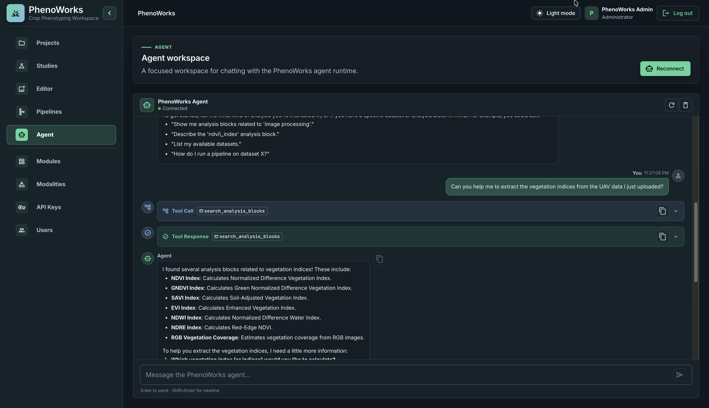

# Tutorial: Analyze Data with the Agent

In this tutorial, you will learn how to interact with the PhenoWorks Agent using
natural-language messages. You can describe your research question, ask about a
dataset, or request a processing task in the chat. The agent can help you find
available analysis modules, check their input requirements, run analysis
pipelines, follow their progress, and review the results.

The steps below take you from identifying a dataset to interpreting its outputs.
The tasks available to the agent depend on your installed modules and account
permissions.

## 1. Identify the data

Open **Agent** and start by giving the dataset name or ID:

> I want to analyze dataset 7. What data does it contain?

The agent summarizes the dataset's contents per survey: which data products it
holds (images, orthomosaics, point clouds, tables), from which sensors, and with
which named bands. Check that it has identified the dataset you intend to use.
Describe the crop, imaging setup, and research question to help it find a
suitable method.

If the data is not in PhenoWorks yet, ask:

> How should I upload drone orthomosaics and plot boundaries for this study?

The agent explains the three upload methods and the ZIP sidecar format. See
[Importing Data](import-data.md) for the same guidance.

## 2. Ask for a processing task

For multispectral imagery:

> Can you calculate NDVI for this dataset? Check the available bands and explain which inputs the method needs.

Confirm the NIR and red band indices before running the block. For RGB imagery,
try a suitable image-processing request instead:

> Can you apply histogram equalization to the RGB images in my dataset?

Or ask about a correction without assuming a specific block is appropriate:

> I would like to improve the lighting in these images. Can you find a correction method that fits my imaging setup?

The agent searches your installed analysis modules, also called blocks, and
compares each module's supported inputs (pairs such as `multispectral:orthomosaic`)
and documented requirements with the dataset's contents. It tells you what is
possible, what is missing, and why. NDVI, for example, needs red and NIR bands,
so an RGB-only dataset cannot provide it.

If no installed module fits, the agent can suggest catalog modules and, once you
choose one, install it after you confirm. It can read the source of public
modules; for private modules it relies on their documentation.

## 3. Review and run

Before starting the analysis, ask the agent to validate the proposed pipeline:

> Check that the processing steps, inputs, and parameters are valid. Summarize the pipeline before running it.

Review the dataset, method version, and parameters, then ask the agent to run the
pipeline. Installing a module and running a pipeline each show a
**Confirmation required** panel in the chat; select **Confirm** to proceed or
**Decline** to stop. The agent can send each module only the files it needs,
such as multispectral orthomosaics, rather than the whole dataset.

Keep the returned run ID. It is the same number shown in the **Job** column on
**Jobs**, and it is the only ID you need to check the run or list its outputs.

## 4. Follow progress and inspect outputs

> Check this pipeline's progress and retrieve its output table when it is complete.

Submitting a pipeline starts the run; check its status to confirm that
processing has finished. If the run fails, ask the agent to explain the error and
review the log before trying again.

Each reply shows a collapsible activity line with the number of tool calls and
the progress of the current one; expand it to see what the agent did. When the
agent downloads an artifact, a button named after the file appears in the chat;
select it to save the file. You can also open the run on **Jobs** and select
**View artifacts** to compare a few results with the source data.

## 5. Interpret the result

> Can you help me interpret the differences in NDVI across these plots and surveys? Identify any missing treatment or acquisition information.

Results carry survey dates, so the agent can describe change over the season
when a dataset holds several surveys.

Review the agent's interpretation against the measurements and study design.
When you have results ready to describe, ask the agent to help draft a research
section using the methods and findings from your analysis.
