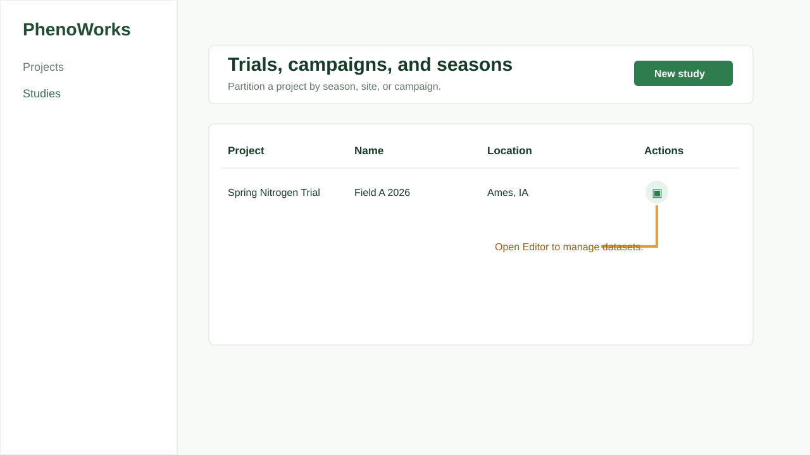

# Tutorial: Creating Your First Project

## Objective

Create the first project and study that will hold datasets and plot assets.

## Prerequisites

- Backend and frontend are running.
- You can sign in as an administrator or project owner.

## Estimated Time

10 minutes.

## Steps

1. Sign in.
2. Open **Projects**.
3. Select **New project**.
4. Fill in the name, owner, and description.
5. Save the project.

6. Open **Studies**.
7. Select **New study**.
8. Choose the project and enter study details.
9. Save the study.

## Expected Result

You have one project and one study. The study is available in the editor tree for dataset and file organization.

## Common Mistakes

- Creating datasets before choosing a clear study boundary.
- Leaving project ownership assigned to the wrong user.

## Tips

Use descriptions to capture field, crop, treatment family, and season in plain language.

Next, [import images and supporting documents](import-data.md). Shared project
access also determines what collaborators can retrieve through the Agent or MCP.
