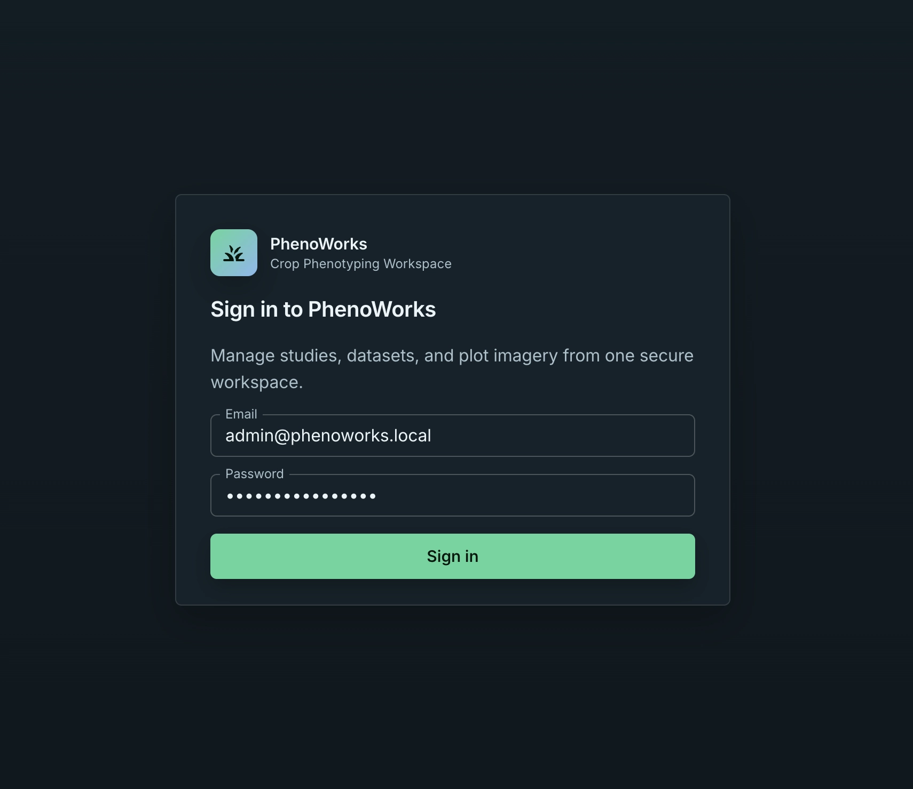
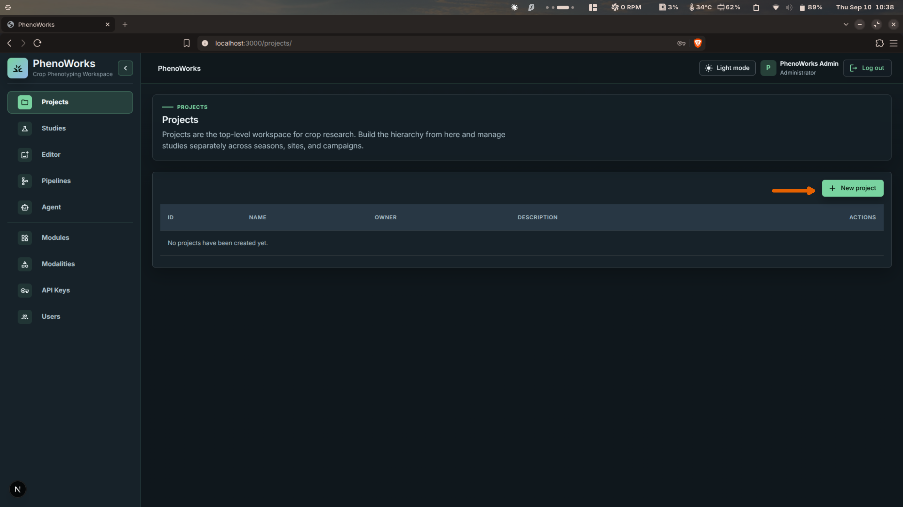
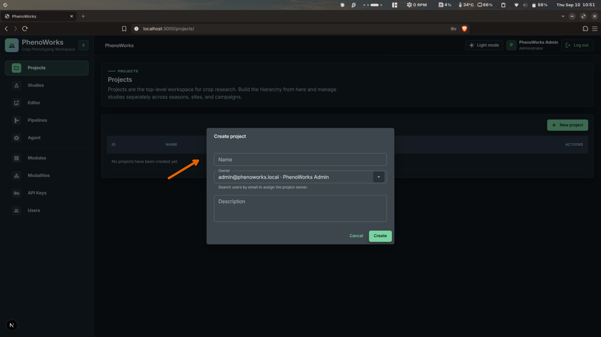
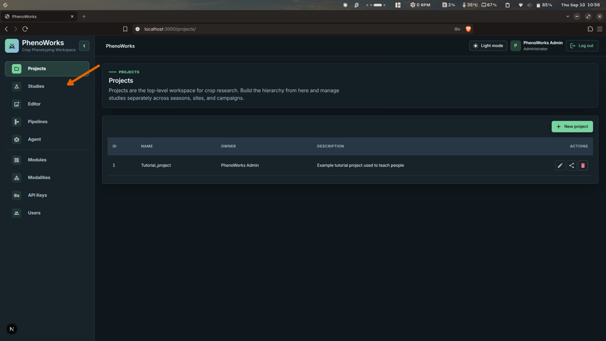
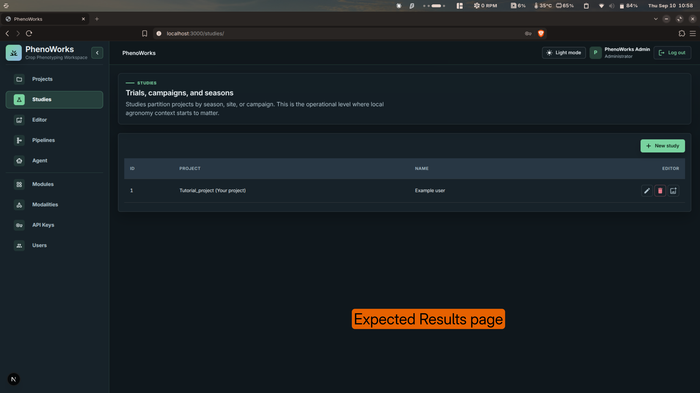

# Tutorial: Creating Your First Project

## Objective

Create the project and study that will hold your datasets.

## Prerequisites

- Backend and frontend are running.
- You can sign in to PhenoWorks.

## Estimated Time

10 minutes.

## Quick route: the guided setup

If you want to analyze data straight away, open **Home** and follow
**Set up an analysis**. Its **Project** step creates a project, a study, and a
dataset in one go, then continues to the upload and analysis steps. See
[Running a Workflow](run-workflow.md#option-a-the-guided-setup-on-home).

The steps below create a project and study on their own, which is useful when
you want to describe them fully before adding data.

## Steps

1. Sign in.

2. Open **Projects**.
3. Select **New project**.
4. In **Create project**, enter the **Name** and **Description**. Projects you
   create are assigned to your account; administrators can choose another
   **Owner**.
5. Select **Create**.

6. Open **Studies**.

7. Select **New study**.
8. In **Create study**, choose the **Project** and enter a **Name**. Optionally
   add a description, abstract, methods summary, start and end dates, and
   metadata as JSON.
9. Select **Create**.

## Expected Result

You have one project and one study. Open **Editor**: the study appears under the
project in the **Data explorer**, ready for its first dataset.

## Share the project

Select **Share project** on the project's row to add collaborators. Members can
view the project's data and results; only the owner can upload files or change
its structure. Shared access also determines what collaborators can retrieve
through the Agent or MCP.

## Common Mistakes

- Creating datasets before choosing a clear study boundary.
- Leaving project ownership assigned to the wrong user.

## Tips

Use descriptions to capture field, crop, treatment family, and season in plain
language. A study can hold several datasets, and a dataset several surveys, so a
new collection date does not require a new study.

Next, [create a dataset and import data](import-data.md).
