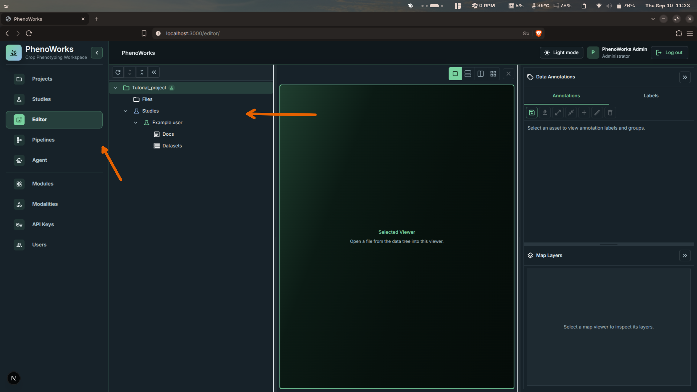
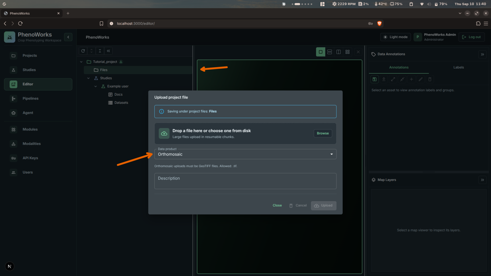
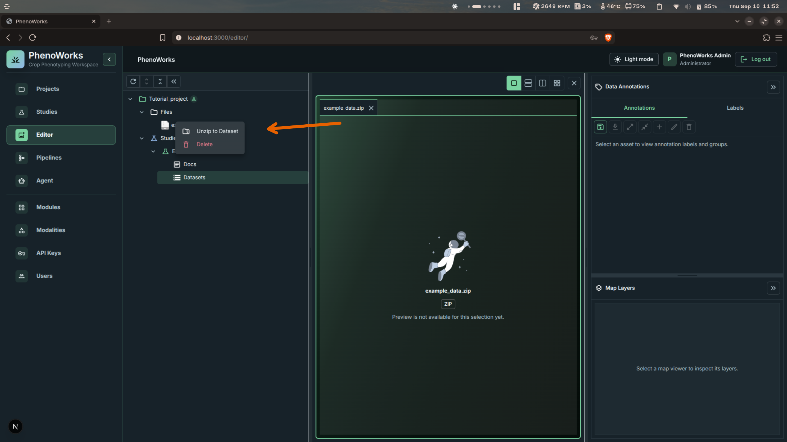
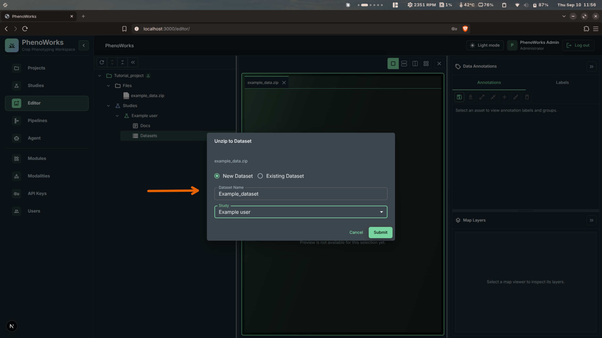
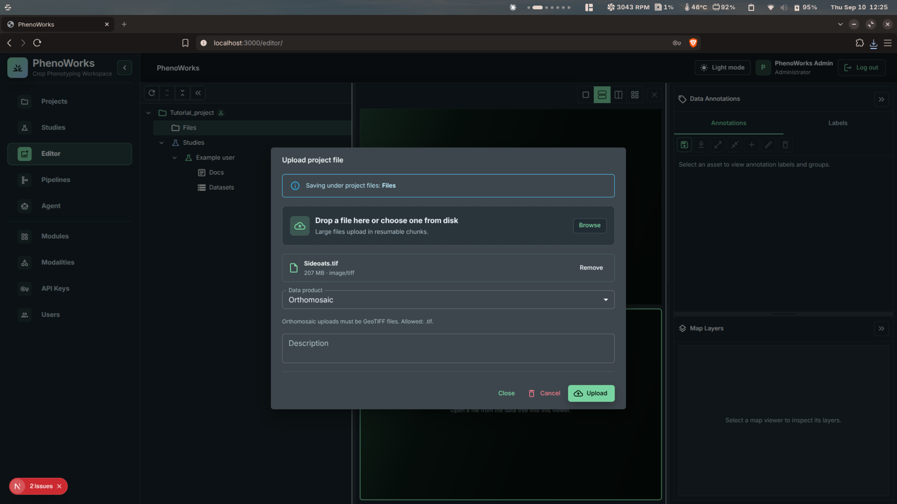
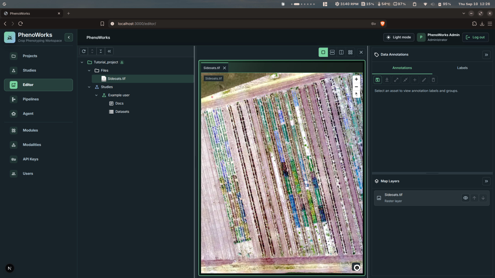
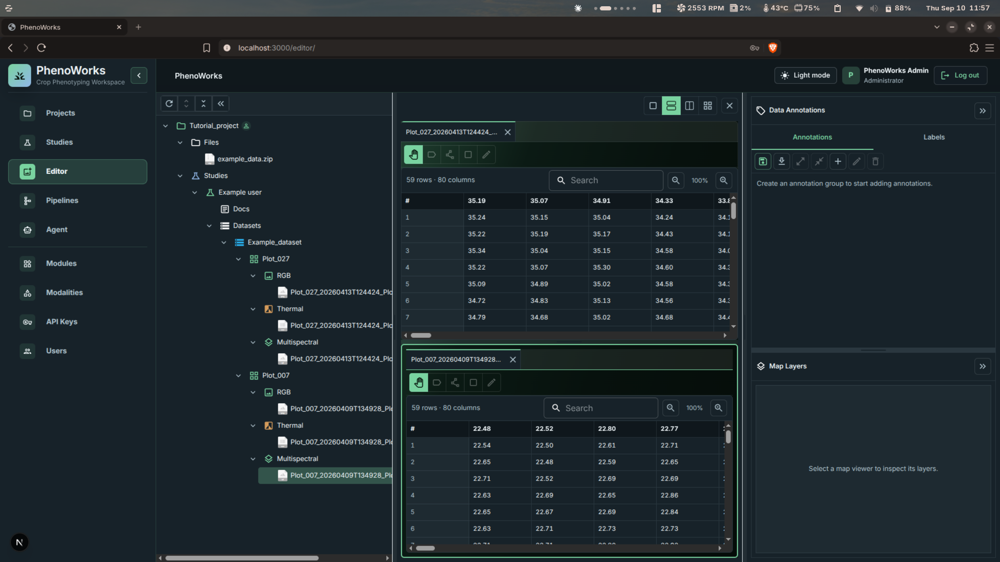

# Tutorial: Importing Data

## Objective

Bring plot data into a study, either by uploading a packaged archive or by
registering individual assets, and preview the results in the editor.

## Prerequisites

- A project and study exist.
- Asset files are available on disk, either individually or packaged as an archive.
- Dataset modality choices are known.

## Estimated Time

20 minutes.

## Import routes

There are two ways to get data into a dataset:

- **Upload an archive and unzip it into a dataset.** Fastest when your plots and
  modalities are already organized into folders. This is the route shown in the
  walkthrough below.
- **Upload individual files and choose their data product type.** Better for a
  single large file such as an orthomosaic, for adding a few assets, or when your
  files are not packaged.

Both routes use the same **Upload** dialog. Select the **Data product** type that
matches your files and the dialog shows the formats that type accepts — for
example, an Orthomosaic upload accepts GeoTIFF (`.tif`). The steps after the
upload differ by type, but selecting the type and browsing for the file is the
same in every case.

## Steps: uploading a zipped archive

1. Open **Editor**.
2. Select the target project and study in the data tree.

3. Right-click **Files** and select **Upload**.
4. Choose the **Data product** type that matches your files, select the file from disk, and select **Upload**.

5. Right-click the uploaded archive and select **Unzip to Dataset**.

6. Select **New Dataset**, enter a dataset name, confirm the study, and select **Submit**.

7. Expand the dataset in the tree and select a file to load it in the viewer.
8. Use the layout controls in the viewer toolbar to open a second file and compare the two side by side.

The archive's folder layout determines the plots and modalities that appear under
the dataset, so arrange it to match the structure you want before uploading.

## Steps: uploading a single file

Use this route for one file at a time, such as an orthomosaic.

1. Open **Editor**.
2. Select the target project in the data tree.
3. Right-click **Files** and select **Upload**.
4. Select **Browse** and choose the file. The dialog confirms its name, size, and type.
5. Set **Data product** to the type that matches the file — **Orthomosaic** for a GeoTIFF. The dialog lists the extensions that type accepts.
6. Select **Upload**.

7. Select the uploaded file in the tree to open it in the viewer.
8. Use the **Map Layers** panel to toggle layer visibility and change layer order.

### Registering assets plot by plot

You can also build a dataset up manually rather than unzipping one:

1. Create a dataset.
2. Enable the modalities that match your files.
3. Create plots under the dataset.
4. Register or upload an asset for each plot.
5. Select an asset to confirm that the preview renders.

## Expected Result

For an archive import, the editor tree shows the dataset with its plots and each
plot's modalities. Selecting a file loads it in the viewer or shows an
appropriate preview state, and two files can be open at once for side-by-side
comparison.

For a single-file import, the file appears under the project's **Files** and
opens in the viewer, with any raster layers listed in **Map Layers**.

## Common Mistakes

- Registering assets under the wrong plot.
- Enabling too few modalities for the dataset.
- Using inconsistent plot names.
- Choosing a data product type that does not accept your file format. The upload
  dialog lists the allowed extensions for the selected type.
- Unzipping into the wrong study when a project contains several.
- Archive folder names that do not match the plot and modality layout you expect
  in the dataset.

## Add documents and prepare for analysis

Attach a field protocol, reference PDF, or manuscript draft to the project or
study in the editor. Keep these supporting files separate from the plot image
assets expected by an analysis block.

Before processing, confirm that plot labels and modalities match the files.
For NDVI, verify that the multispectral images include the required red and
near-infrared bands and record their order. For RGB processing, inspect a few
images for lighting and contrast issues.

Continue with [Running a Workflow](run-workflow.md) or ask the
[Agent](analyze-with-agent.md) to help select a suitable method.

## Tips

For batch work, keep file names aligned with plot labels before import.
