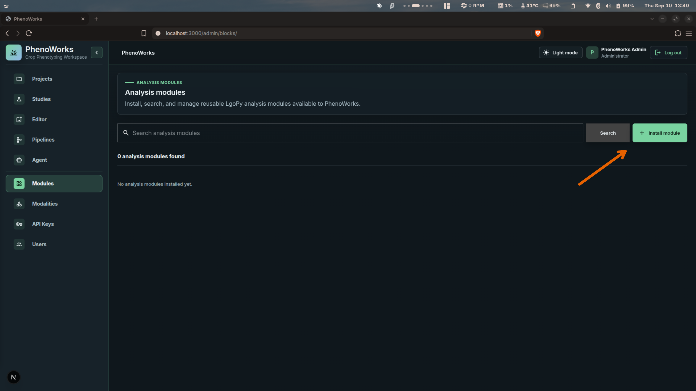
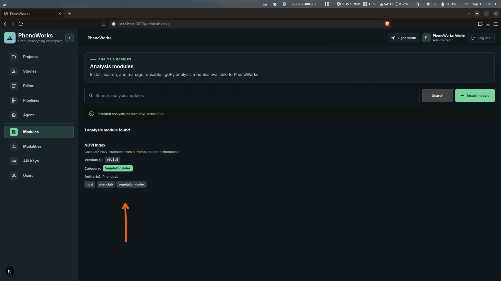
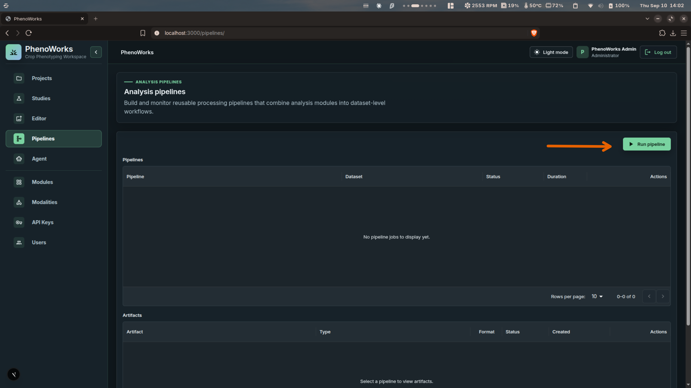
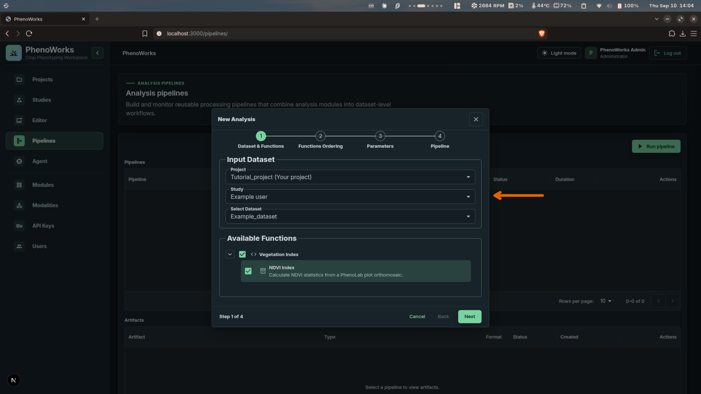
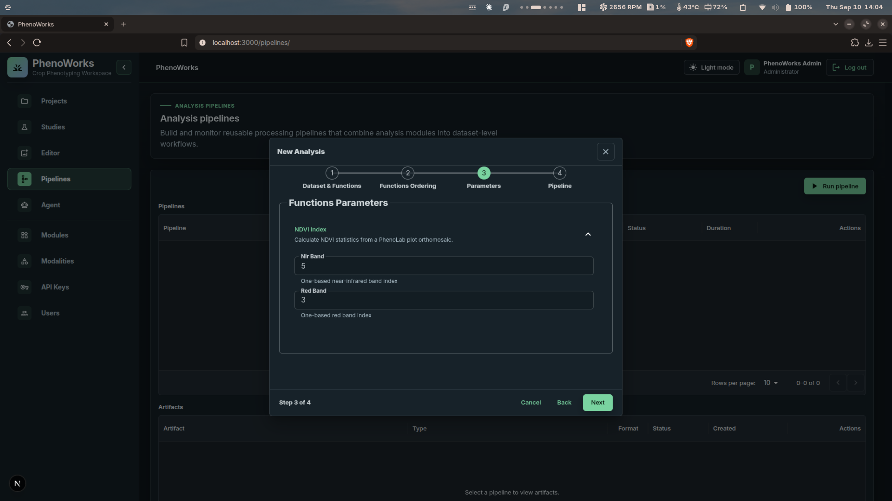
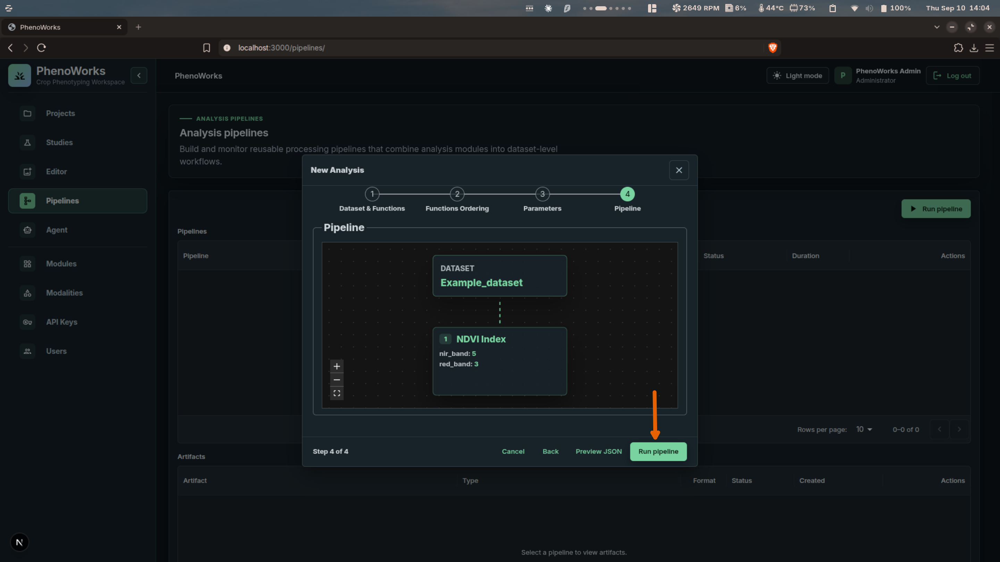

# Tutorial: Running a Workflow

Install an analysis module, build a one-step pipeline around it, and run it
against a dataset. This example uses the **NDVI Index** module to calculate
vegetation-index statistics from plot orthomosaics.

## Before you start

You need a project with an accessible dataset containing multispectral assets, a
running worker, and the module you intend to run. If the module is not installed
yet, have its built package zip ready.

Check the one-based NIR and red band indices against your sensor's band order
before running. RGB imagery alone does not supply a near-infrared band.

## 1. Check that the module is installed

Open **Modules** and look for the module you need. The list shows every analysis
module available to PhenoWorks, with its version, category, and author.

If it is missing, select **Install module**, choose the module's zip, and select
**Install**. The page confirms the installed name and version.

## 2. Start a new analysis

Open **Pipelines** and select **Run pipeline**. This opens the **New Analysis**
wizard, which has four steps.

In **Dataset & Functions**, choose the project, study, and dataset, then select
the modules to run from **Available Functions**. Modules are grouped by category.

Select **Next** to continue to **Functions Ordering**. This example runs a single
module, so there is no ordering to set. When you do chain modules, verify that
each output matches the next input — an image saved as an artifact is not
necessarily the value returned to the next step.

## 3. Set the parameters

In **Parameters**, fill in the inputs each module needs. NDVI Index takes the
one-based band indices for the near-infrared and red bands.

## 4. Review and run

In **Pipeline**, inspect the graph to confirm the dataset feeds into the module
with the parameters you set. Select **Preview JSON** to check the full
definition, then select **Run pipeline**.

## 5. Monitor and inspect the result

The new job appears in the pipeline list. Open **View output log** to follow its
progress. The request is queued for the worker, so allow the job to finish before
interpreting the outputs.

If it fails, read the error message and confirm the dataset's asset structure,
file accessibility, and module dependencies before retrying.

When it completes, select the pipeline to view its **Artifacts**. The worker
saves DataFrame results as an Excel workbook.

## Try image processing next

For RGB data, the bundled `histogram_equalization` module adjusts contrast and
returns a table with one row per processed asset. Its source is
`blocks/image_analysis/histogram_equalization.py`. Review a few images first —
whether histogram equalization improves a particular dataset needs visual
assessment.

Continue with [Viewing and Exporting Results](view-export-results.md), or run
an analysis conversationally with the [Agent](analyze-with-agent.md).
