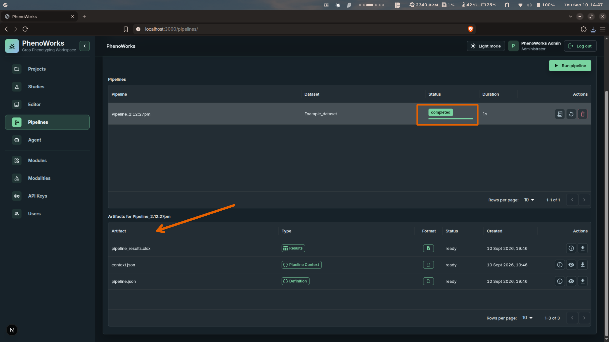

# Tutorial: Viewing and Exporting Results

Inspect a completed pipeline, download its outputs, and keep enough context to
reuse the results in analysis or writing.

## Before you start

You need access to the project and a pipeline that has produced artifacts. If
you have not run one yet, follow [Running a Workflow](run-workflow.md).

## Review the run

1. Open **Pipelines** and find the run for your dataset.
2. Check the **Status** column. A run reads `completed` when the worker has
   finished; **Duration** shows how long it took.
3. Select **View output log** and review messages, warnings, and any error
   details.
4. Select the pipeline row. Its artifacts load in the **Artifacts** table below
   the pipeline list.
5. Preview supported text content, or select **Download artifact**.

## What a run produces

Every run writes three kinds of artifact, each tagged by **Type**:

| Type | File | Contents |
| --- | --- | --- |
| Results | `pipeline_results.xlsx` | The measurements the modules returned, one row per processed asset |
| Pipeline Context | `context.json` | The runtime context the pipeline executed in |
| Definition | `pipeline.json` | The dataset, modules, and parameters that defined the run |

An artifact is downloadable once its **Status** reads `ready`. Text-based
artifacts such as the two JSON files can also be previewed in place; the Excel
workbook has to be downloaded to be read.

Beyond these three, the files depend on the modules used. An image-processing run
may also produce PNG or JPEG files. Other serializable results are stored as
JSON.

Keeping `pipeline.json` alongside the results is what makes a run reproducible —
it records the exact module versions and parameter values, so you can rerun or
audit the analysis later without relying on memory.

## Keep the context

Record the dataset, pipeline, module versions, and parameters with your
downloaded files. Before comparing two tables, check units, plot labels,
acquisition dates, and whether both runs used comparable methods.

Note that a pipeline's name is generated from the time it was started, so names
alone do not tell you which dataset or module a run used. Read that from the
**Dataset** column or from `pipeline.json`.

## Continue with the Agent or MCP

Ask the agent to retrieve the run and explain a specific output:

> Find the results from pipeline 12 and help me understand the plot measurements.

An MCP client can use `list_artifacts` and `download_artifact`. Downloaded files
are stored on the MCP host, which may differ from your laptop. The browser's
download action saves files through your browser.

Use the reviewed evidence for [downstream analysis](../features/results-exports.md)
or [drafting a research section](draft-research-sections.md).
